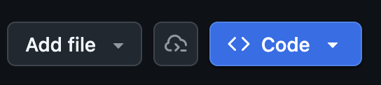
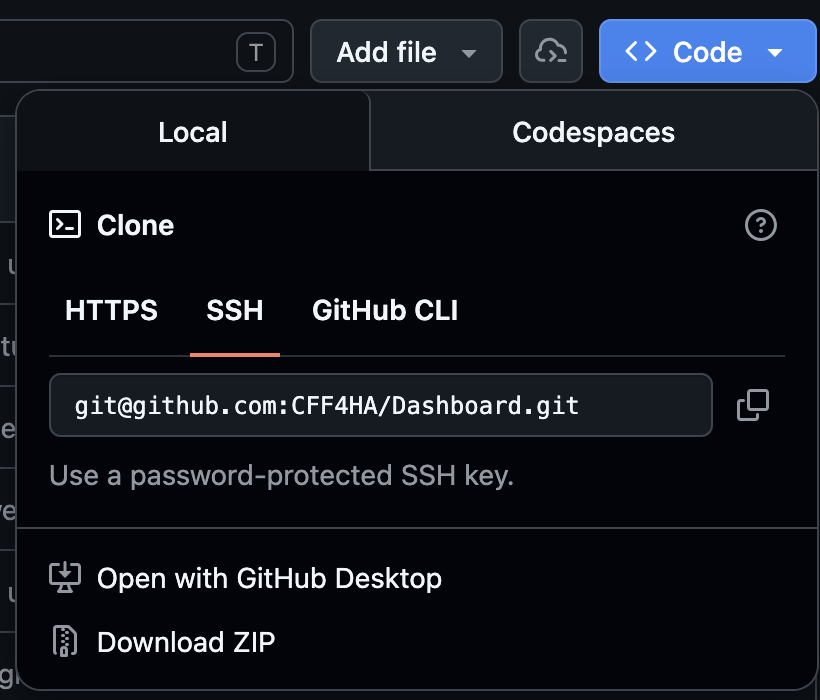

  

> A web-app designed to facilitate ingredient and product analysis for people with fragrance sensitivities.

## Contents

- [Running the Site Locally](#running-the-site-locally)
    - [Required Software](#required-software)
    - [Step-By-Step Guide](#step-by-step-guide)
- [Migrating the Site to your own Railway Project](#migrating-the-site-to-your-own-railway-project)

## Running the Site Locally

You can set-up your own private version of this site! By the end of these steps, you'll have a website that you can access from your own browser, accessible only to you while the laptop is on.

### Required Software

- [Docker](https://docs.docker.com/get-started/get-docker/). Depending on the operating system your computer is using, you may visit the following YouTube guides. If you're not sure what your operating system is, feel free to visit [this site](https://whatsmyos.com/).
  - [Installing on Windows](https://youtu.be/ZyBBv1JmnWQ?si=8TE3l2_2bygPzgMp).
  - [Instaling on MacOS](https://youtu.be/-EXlfSsP49A?si=7E-msHXqkjoXfVxR).
  - [Installing on Linux](https://youtu.be/J4dZ2jcpiP0?si=y81UMfJilLe-6DqO).
- [Docker-Compose](https://docs.docker.com/compose/install/). Operating system specific details are included in the following links.
  - [Install on Windows](https://docs.docker.com/desktop/setup/install/windows-install/).
  - [Install on MacOS](docs.docker.com/desktop/setup/install/mac-install/).
  - [Install on Linux](https://docs.docker.com/desktop/setup/install/linux/).

### Step-By-Step Guide

1. Install the required software specified above.
2. Open the "Docker Desktop" app. Keep it running for the duration of this process.

> If this is the first time downloading and running this website, you need to the following steps. If you've already done this once, you may skip this section.

3. Download the code by going to the Github repository: https://github.com/CFF4HA/Dashboard.

    - Click on the "Code".
    

    - Click on the "Download ZIP".
    

4. Unzip the contents. For help with this, please visit the following [article for Windows](https://support.microsoft.com/en-us/windows/zip-and-unzip-files-8d28fa72-f2f9-712f-67df-f80cf89fd4e5) and the following one [for MacOS](https://support.apple.com/guide/mac-help/zip-and-unzip-files-and-folders-on-mac-mchlp2528/mac).

> The following section must be done every time you want to run the app!

4. Open the "Command Line". For instructions on how to do this use the following video:
    - For [Windows](https://www.youtube.com/watch?v=uE9WgNr3OjM).
    - For [MacOS](https://www.youtube.com/watch?v=i21v35DqAYs).

5. Navigate to the folder where you downloaded AND unzipped the code. 
    - On MacOS this can be done by typing `cd` and then the path to the directory you want to go to (i.e., `~/Downloads`, `~/Projects/Dashboard`, etc).

6. Run the following command: `docker-compose up`.

> You now have the website running and you can visit it [here](http://localhost:8080). 

## Migrating the Site to your own Railway Project

> Coming soon with release of v1.1.0 on May 6th, 2026.